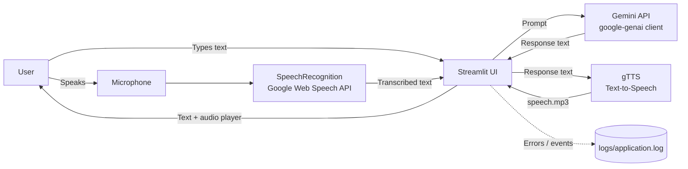

# 🌐 Multilingual AI Assistant

A voice- and text-enabled AI assistant built with **Streamlit**, **Google Gemini**, **Google Speech Recognition** and **gTTS**. Ask a question by typing or speaking, get an answer from a large language model, and hear the answer read back in your language.

## ✨ Features

- 🎤 **Voice input** via microphone (Google Speech Recognition)
- ⌨️ **Text input** through a simple Streamlit UI
- 🧠 **LLM responses** powered by Google Gemini (`google-genai` SDK)
- 🔊 **Text-to-speech output** using gTTS, played in the browser
- 🌍 **Multilingual**: speech recognition and speech synthesis language are configurable
- 📝 **Logging** of errors and recognition failures to `logs/application.log`
- 🔐 **Secrets via environment variables** (no API keys in code)

## 🏗️ Architecture



### Request flow

1. **Input**: the user types a question or clicks the mic button.
2. **Speech-to-Text**: `speech_recognition` captures audio and sends it to the Google Web Speech API using the selected language code (for example `en-IN`, `hi-IN`).
3. **Reasoning**: the text prompt is sent to Gemini through `genai.Client(...).models.generate_content(...)`.
4. **Text-to-Speech**: the answer is converted to `speech.mp3` by gTTS in the selected language.
5. **Output**: Streamlit shows the answer text and an audio player.
6. **Observability**: failures at any stage are written to `logs/application.log`.

### Components

| Layer | Technology | Responsibility |
|---|---|---|
| Frontend | Streamlit | UI, language selector, input widgets, audio player |
| ASR (speech-to-text) | SpeechRecognition + PyAudio | Capture mic audio and transcribe it |
| LLM | Google Gemini (`google-genai`) | Generate the answer |
| TTS (text-to-speech) | gTTS | Convert the answer to an MP3 |
| Config | Environment variables / `.env` | Store `GEMINI_API_KEY` safely |
| Logging | Python `logging` | Persist errors and events |

## 📁 Project Structure

```
Multilingual-ai-assistant/
├── main.py            # Streamlit app + ASR, LLM and TTS helpers
├── requirements.txt   # Python dependencies
├── logs/              # Runtime logs (application.log)
├── .gitignore
└── readme.md
```

## ⚙️ Getting Started

### Prerequisites

- Python 3.10+
- A Gemini API key from [Google AI Studio](https://aistudio.google.com/apikey)
- A working microphone (for voice input)

### Installation

```bash
# 1. Clone the repository
git clone https://github.com/Manishthakur99/Multilingual-ai-assistant.git
cd Multilingual-ai-assistant

# 2. Create and activate an environment
conda create -n assistant python=3.10 -y
conda activate assistant

# 3. Install dependencies
python -m pip install -r requirements.txt
```

> **macOS note:** if PyAudio fails to install, run `brew install portaudio` first, then `python -m pip install pyaudio`.

### Configuration

Create a `.env` file in the project root:

```
GEMINI_API_KEY=your_api_key_here
```

Or export it in your terminal:

```bash
export GEMINI_API_KEY="your_api_key_here"
```

> ⚠️ Never commit your API key. `.env` is listed in `.gitignore`.

### Run

```bash
python -m streamlit run main.py
```

Open http://localhost:8501 in your browser. On first use, allow microphone access for your terminal when macOS asks.

## 🌍 Supported Languages

| Language | Speech recognition | TTS |
|---|---|---|
| English (India) | `en-IN` | `en` |
| Hindi | `hi-IN` | `hi` |

To add a language, add an entry to the `LANGUAGES` dictionary in `main.py` with its recognition code and gTTS code.

## 🧰 Tech Stack

`Python` · `Streamlit` · `Google Gemini (google-genai)` · `SpeechRecognition` · `PyAudio` · `gTTS` · `python-dotenv`

## 🛠️ Troubleshooting

| Problem | Fix |
|---|---|
| `No API key was provided` | Set `GEMINI_API_KEY` in `.env` or export it in the same terminal that runs Streamlit |
| `ModuleNotFoundError` | Run `python -m pip install -r requirements.txt` and start the app with `python -m streamlit run main.py` |
| Model 404 / not found | Update the model name in `main.py` to one available in your AI Studio account |
| Mic not working | Grant microphone permission to your terminal in system settings |

## 🚀 Roadmap

- [ ] Conversation history / chat memory
- [ ] Automatic language detection
- [ ] More languages (Marathi, Tamil, Bengali, etc.)
- [ ] Browser-based mic input so it works when deployed
- [ ] Docker support and cloud deployment

## 📄 License

This project is licensed under the MIT License.

## 👤 Author

**Manish Thakur**: [GitHub](https://github.com/Manishthakur99)
